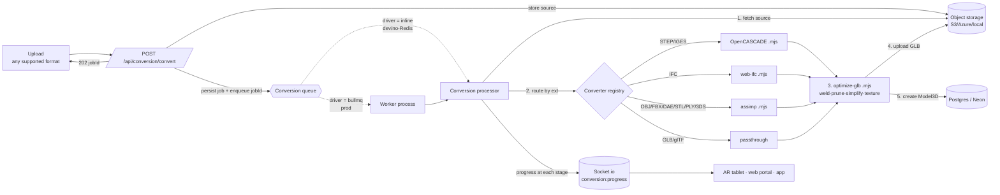

# 3D File Conversion Pipeline → GLB (for AR / Web / App)

**Status:** Implemented (Phase 1 + 2). **Owner:** Platform. **Last updated:** 2026-06-07

This document describes the pipeline that ingests the 3D file formats steel
fabricators actually use, converts them to a single optimized **GLB**, and makes
that GLB usable in three places: the **AR tablet** (Viro), the **web portal**
(Angular), and the **mobile app** (React Native).

---

## 1. Goal

> "Accept the industry-standard 3D files our fabricators produce, convert each to
> a GLB, and project it on an AR tablet."

One canonical output (**GLB**) because it is the only format that renders
natively in all three of our surfaces — Viro AR, `<model-viewer>`/three.js on the
web, and Viro in the app — so we convert once and reuse everywhere. No per-surface
variants are required.

---

## 2. Current state (before this change)

The backend already had a partial, fragmented pipeline:

| Capability | Where | Notes |
|---|---|---|
| STEP / IGES → GLB | `cad-conversion/scripts/convert-cad.mjs` | OpenCASCADE WASM, spawned child, 2-min cap |
| IFC → GLB | `cad-conversion/scripts/convert-ifc.mjs` | web-ifc, spawned child, 5-min cap |
| GLB/glTF storage | `models/` | stored as-is; `/api/models/:id/file/ar` adds AR tangents (gltf-transform + mikktspace) |
| Pluggable storage | `storage/` | S3 / Azure / local, selected by `STORAGE_TYPE` |
| Real-time progress | `websocket/events.gateway.ts` | `coordination:progress` precedent |

**Gaps this pipeline closes**

1. **Mesh/DCC formats were accepted at upload but never converted.** Multer
   accepted `.obj/.fbx/.stl`, but `ModelsService.create()` stored them as-is and
   `CadConversionService` rejected them — so an uploaded FBX/OBJ landed as a
   non-GLB blob and broke the GLB-only AR path. These are exactly the formats
   that come out of Tekla/Navisworks/SketchUp for visualization.
2. **No durable job model.** Conversion ran synchronously or fire-and-forget with
   2–5 minute timeouts: large assemblies time out, and in-flight work is lost on
   restart/crash, with no retries or concurrency control.
3. **No AR optimization stage.** Output was un-decimated, so large CAD assemblies
   are heavy on a tablet.

---

## 3. Format strategy (steel fabrication)

"All industry-standard formats" is unbounded, so we scope to what steel
fabricators actually exchange, in priority order. Sources: Tekla / Advance Steel
interoperability docs (IFC, STEP, DWG/DXF, CIS/2, SDNF; NC/DSTV for CNC).

| Format | Ext | Source tools | Converter | Phase |
|---|---|---|---|---|
| IFC (BIM/structural) | `.ifc` | Tekla, Advance Steel, SDS/2, Revit | web-ifc *(existing)* | ✅ have |
| STEP | `.step .stp` | Most CAD/CIS-2 | OpenCASCADE *(existing)* | ✅ have |
| IGES | `.iges .igs` | Legacy CAD | OpenCASCADE *(existing)* | ✅ have |
| Wavefront OBJ | `.obj` | Navisworks, SketchUp, viewers | **assimp (new)** | ✅ added |
| Autodesk FBX | `.fbx` | 3ds Max, Navisworks, Unity flows | **assimp (new)** | ✅ added |
| COLLADA | `.dae` | SketchUp, exchange | **assimp (new)** | ✅ added |
| STL | `.stl` | Mesh/3D-print, scans | **assimp (new)** | ✅ added |
| PLY | `.ply` | Scans / point-derived meshes | **assimp (new)** | ✅ added |
| 3DS | `.3ds` | Legacy 3ds Max | **assimp (new)** | ✅ added |
| glTF / GLB | `.gltf .glb` | Web/AR native | passthrough → optimize | ✅ added |
| SDNF | `.sdnf` | Steel data exchange | needs dedicated translator (data, not mesh) | ⏳ future |
| CIS/2 | `.stp .p21` | Analysis/exchange | partial via STEP path | ⏳ future |
| DSTV / NC1 | `.nc1 .nc` | CNC beam/plate machines | needs DSTV parser (per-part CNC geometry) | ⏳ future |
| DWG / DXF | `.dwg .dxf` | AutoCAD / Advance Steel | needs ODA/Teigha; mostly 2D drawings | ⏳ future |

**Why this split.** IFC/STEP/IGES (already handled) cover the BIM/CAD side. The
new **assimp** converter (one WASM tool, 40+ importers) covers every mesh/DCC
format a fabricator's visualization tools emit. SDNF/CIS-2/DSTV/DWG are
*data/CNC/drawing* formats, not tessellated meshes — they need dedicated
translators and deliver little for AR viewing, so they are explicitly deferred,
not half-implemented.

---

## 4. Architecture



### 4.1 Queue abstraction (the "best pattern", without forcing new infra in dev)

Heavy conversions must not run inside the request, and must survive restarts. But
we also don't want to force every developer to run Redis. So the queue is a
**provider chosen by env**, mirroring the existing `STORAGE_TYPE` pattern:

- **`CONVERSION_DRIVER=bullmq`** (auto-selected when `REDIS_URL` is set):
  durable [BullMQ](https://docs.bullmq.io/) queue on Redis — retries, backoff,
  concurrency limits, survives restarts. Jobs are consumed by a **separate worker
  process** (`npm run worker`), so the serverless API never does CPU-heavy work.
- **`CONVERSION_DRIVER=inline`** (default when no `REDIS_URL`): runs the same
  processor in-process via `setImmediate` — identical pipeline, zero new infra.
  Good for dev and low-volume single-host deploys.

Both drivers call the **same** `ConversionProcessor.process(jobId)`, so behavior
is identical; only durability/scaling differ. This is why the worker and the API
stay in sync.

### 4.2 Why a separate worker (and why it fits this repo)

`package.json`'s `vercel-build` already **strips** `opencascade.js`, `web-ifc`,
`@gltf-transform`, `three`, `mikktspace` from the serverless bundle — i.e. the
serverless API was never meant to convert. The worker is the natural home for
those deps: deploy it as a normal long-running Node process / container with the
conversion dependencies installed, point it at the same `REDIS_URL`, `DATABASE_URL`
and storage. Scale workers horizontally for throughput.

### 4.3 Source handoff via storage (not local temp)

Because the worker may be a different process/host, the uploaded source file is
written to **object storage** (`conversion-sources/<jobId>.<ext>`) at enqueue
time, and the processor fetches it from there. This is what makes the BullMQ path
correct across processes; the inline path uses the same flow for consistency.

---

## 5. Data model — `conversion_jobs`

A durable row is the backbone of robustness: status is queryable, survives
restart, and drives the status endpoint + UI.

| Column | Type | Purpose |
|---|---|---|
| `id` | uuid PK | job id (returned to client) |
| `original_name` | varchar | uploaded filename |
| `source_format` | varchar | e.g. `fbx`, `step`, `ifc` |
| `status` | varchar | `pending` → `converting` → `optimizing` → `uploading` → `completed` / `failed` |
| `progress` | int | 0–100 for UI |
| `source_key` | varchar | storage key of the original upload |
| `source_size` | bigint | bytes |
| `output_key` | varchar | storage key of the final GLB |
| `output_size` | bigint | bytes |
| `triangles_before` / `triangles_after` | int | optimization report |
| `model_id` | uuid | the `Model3D` created on success |
| `name` / `description` / `model_type` | — | passthrough to `Model3D` |
| `error` | text | failure detail |
| `duration_ms` | int | wall-clock |
| `created_by_id` | uuid | auditing |
| `created_at` / `updated_at` | timestamp | — |

Created automatically via TypeORM `synchronize` (consistent with the rest of the
codebase; a migration can be generated later with the existing `migration:generate`
script).

---

## 6. Pipeline stages (`ConversionProcessor`)

1. **fetch** — download `source_key` from storage to a temp file.
2. **convert** — route by extension via the registry:
   STEP/IGES → OpenCASCADE, IFC → web-ifc, mesh formats → assimp, GLB/glTF →
   passthrough. Output: an intermediate GLB.
3. **optimize** *(unless `optimize=false`)* — `optimize-glb.mjs`:
   `dedup → prune → weld → simplify(ratio) → texture resize/recompress`. Records
   triangle counts before/after.
4. **upload** — write the final GLB to storage (`models/<uuid>.glb`).
5. **persist** — create a `Model3D` (reusing `ModelsService`), link `model_id`,
   mark `completed`. The model is then immediately consumable by the existing
   `/api/models/:id/file` and `/api/models/:id/file/ar` endpoints.

Every transition emits `conversion:progress`. On any failure the job is marked
`failed` with the error, an event is emitted, and temp files are cleaned up.
BullMQ retries transient failures (configurable attempts/backoff).

---

## 7. API

| Method | Route | Purpose |
|---|---|---|
| `POST` | `/api/conversion/convert` | multipart upload; persists job, stores source, enqueues; returns `202 { jobId, status }` |
| `GET` | `/api/conversion/:id` | job status/progress + `modelId` when done |
| `GET` | `/api/conversion/formats` | supported input formats (drives client file picker) |

Guarded by `JwtAuthGuard` + `RolesGuard` (`admin`, `manager`), matching the CAD
controller. Max upload 500 MB (same as CAD/models).

> The existing `POST /api/cad/convert-and-upload` keeps working unchanged; the new
> endpoint supersedes it by also accepting mesh formats and running async. We can
> redirect the CAD route to the new pipeline once clients migrate.

---

## 8. Real-time progress

`EventsGateway.emitConversionProgress({ jobId, status, progress, ... })` emits:

- globally as `conversion:progress` (dashboards), and
- to room `conversion:<jobId>` (a client watching one upload).

Mirrors the `coordination:progress` precedent, so the web/app real-time layer
needs no new transport — just subscribe to the event.

---

## 9. Optimization for AR / web / app

Tablets are the constraint. The **default** optimization uses only
**decoder-agnostic** operations, so the output is plain glTF that every renderer
(Viro on iOS/Android, `<model-viewer>`, three.js) loads with no special loader:

- `dedup`, `prune`, `weld` — remove redundant data/vertices.
- `simplify(ratio, error)` — mesh decimation (meshoptimizer). The single biggest
  AR win; reduces triangles with no runtime decoder requirement.
- texture **resize + WebP recompress** (sharp) — caps textures at 2048² (1024²
  optional) and shrinks them.

**Optional, opt-in** (per-request flags), because they add KHR extensions that
require decoder support — safe for the web portal (`<model-viewer>` supports
them), not assumed for Viro:

- `draco=true` — Draco geometry compression (`draco3dgltf`).
- `quantize=true` — `KHR_mesh_quantization`.

Each optional/encoder-dependent step is wrapped so a missing encoder **degrades
gracefully** (skipped, logged) rather than failing the job.

---

## 10. Deployment & configuration

New environment variables (none required for dev):

| Var | Default | Meaning |
|---|---|---|
| `CONVERSION_DRIVER` | `bullmq` if `REDIS_URL` else `inline` | queue backend |
| `REDIS_URL` | — | enables BullMQ + worker |
| `CONVERSION_CONCURRENCY` | `2` | parallel jobs per worker |
| `CONVERSION_QUEUE_NAME` | `pcs-conversion` | BullMQ queue name |
| `CONVERSION_SIMPLIFY_RATIO` | `1.0` (off) | default target triangle ratio |
| `CONVERSION_MAX_TEXTURE` | `2048` | texture clamp (px) |

**Prod topology**

- API (serverless or node): producer only — accepts uploads, enqueues.
- Worker (`npm run worker`): long-running container with conversion deps + Redis +
  storage creds. Scale horizontally.
- Redis: managed (Upstash / ElastiCache) via `REDIS_URL`.

**Dev**: nothing extra — no `REDIS_URL` ⇒ inline driver, conversions run in-API.

---

## 11. Security & limits

- Extension allowlist at upload (multer `fileFilter`) + re-checked in the registry.
- 500 MB cap; converter child processes have hard timeouts (2 min mesh/STEP,
  5 min IFC) so a malformed file can't hang a worker.
- Conversions run in **isolated child processes** — a crashing WASM module kills
  the child, not the worker/API.
- Auth + role guard on all endpoints; `created_by_id` recorded for audit.

---

## 12. Rollout phases

- **Phase 1 — mesh gap + durability (this change).** assimp converter, queue
  abstraction + worker, `conversion_jobs`, async endpoints, progress events.
- **Phase 2 — AR optimization (this change).** decimation + texture compression;
  optional Draco/quantize for web.
- **Phase 3 — robustness at scale.** Redis in prod, worker autoscaling, native
  OpenCASCADE (e.g. `cascadio`) to replace WASM for large STEP assemblies, KTX2
  textures once a `toktx` encoder is in the worker image.
- **Phase 4 — steel data formats (as needed).** SDNF / CIS-2 / DSTV translators,
  DWG/DXF via ODA — only if fabricators send these for visualization.

---

## 13. What this change adds (PR summary)

```
backend/src/conversion/
  conversion.module.ts
  conversion.controller.ts          POST /convert, GET /:id, GET /formats
  conversion.service.ts             persist job, store source, enqueue
  conversion.processor.ts           the staged pipeline
  conversion-job.entity.ts          conversion_jobs table
  worker.ts                         BullMQ worker entrypoint (npm run worker)
  dto/create-conversion.dto.ts
  queue/
    conversion-queue.interface.ts   CONVERSION_QUEUE token
    inline.queue.ts                 in-process driver (default)
    bullmq.queue.ts                 Redis driver (prod)
    conversion-queue.module.ts      env-based provider factory
  converters/
    converter.registry.ts           ext → strategy
    mesh-converter.ts               spawns convert-mesh.mjs
  optimize/
    glb-optimizer.ts                spawns optimize-glb.mjs
  scripts/
    convert-mesh.mjs                assimp: OBJ/FBX/DAE/STL/PLY/3DS → GLB
    optimize-glb.mjs                gltf-transform optimize for AR

backend/src/websocket/events.gateway.ts   + emitConversionProgress()
backend/src/app.module.ts                 + ConversionModule
backend/package.json                       + assimpjs, bullmq, meshoptimizer,
                                             draco3dgltf; + worker scripts
```

Reuses existing `StorageProvider`, `ModelsService`, `CadConversionService`,
`EventsGateway` — additive and low-risk; the old endpoints keep working.
